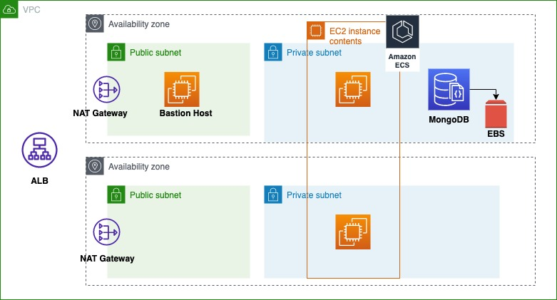

# Phoenix Application Infrastructure

This repository contains a solution to the Phoenix Application Problem, described here: https://github.com/rafdiafer/cloud-phoenix-kata.

### Cloud Phoenix Kata Repository
The only thing added to that repository, where the problem is described and the application is located,
is a Dockerfile to build a docker image for that app, that will be used in the pipeline, which uses a 
Node:8 image, as this is the Node version that it is using.

### Cloud Phoenix Terraform Repository
This is the current repository which builds the infrastructure for the application, using Terraform
as a main tool.

## Set Up: Infrastructure, Pipeline and Installation
There are two main folders:

### Services
This is where some services are defined to support Terraform:
* S3: Storing the Terraform State file.
* DynamoDB: Locking the Terraform file to prevent other team members to perform changes at the same time and corrupt it.
* ECR Repository: Storing the Docker image for the Phoenix application.

The following variables need to be defined:

| Variables     | Default Value | Description  |
| ------------- |:-------------:| :-----|
| aws_region      | eu-central-1 | AWS region for the infrastructure deployment |
| aws_profile      |  -      |   AWS Profile |
| app_name | phoenix      |    The name of the App |

The following commands need to be executed for these services to be provisioned:
```bash
$ terraform init
$ terraform plan
$ terraform apply
```

### Phoenix
Here it is defined the infrastructure for the app, including all the modules needed.

First of all, before deploying the infrastructure, the backend needs to be defined in the backend.tf file
with the outputs information from the Services. As an example:

```
terraform {
  backend "s3" {
    encrypt        = true
    bucket         = "s3-tf-state-phoenix"
    dynamodb_table = "phoenix-dynamodb-tf-state-lock"
    key            = "terraform.tfstate"
    region         = "eu-central-1"
  }
}
```

The following variables need to be defined:

| Variables     | Default Value | Description  |
| ------------- |:-------------:| :-----|
| aws_region      | eu-central-1 | AWS region for the infrastructure deployment |
| aws_profile      |  -      |   AWS Profile |
| app_name | phoenix      |    The name of the App |
| aws_az | eu-central-1a, eu-central-1b     | Availability zones for the AWS region    |
| environment | Prod      |  App environment   |
| aws_key_pair |  default_key_pair     |  AWS Key pair name to use   |
| cidr_block |  172.16.0.0/16     |  CIDR block for the each subnet   |
| github_personal_token | $GITHUB_PERSONAL_TOKEN      | Personal token to provide access to GitHub    |
| github_repo |   https://github.com/rafdiafer/cloud-phoenix-kata    | Github repository URL for the app  |
| github_repo_name | cloud-phoenix-kata     | Github repository name   |
| github_branch |   main    |  GitHub branch name   |
| github_owner | rafdiafer     | Github repository owner    |
| ecr_image_url |   -    | ECR image URL. It is an output from the services in the terraform file.    |
| instance_type | t2.micro      | Instance type to use for the ECS cluster    |
| min_size | 1      | ECS minimum number of instances     |
| max_size | 4      | ECS maximum number of instances    |
| bastion_host_ami | ami-076309742d466ad69      | AMI in use for the Bastion Host instance    |
| source_ip_bastion_host |    -   | To only allow my IP address (or list of IP addresses) to connect to the Bastion Host    |
| container_name | phoenix     | Container name    |
| container_port | 3000      | Application port |
| sns_subscription_email_address_list  |  -     | Email to send CPU peak alert |
| mongo_container_cpu |  1024     | CPU capacity required for mongo container (1024 == 1 CPU)  |
| mongo_version | latest      | Docker image version of Mongo |
| mongo_container_memory | 500      | Memory required for Mongo container |
| mongo_username | user      | MongoDB app username |
| mongo_user_pass | -      | MongoDB app user password  |
| mongo_root_pass | -      | MongoDB Root user password |
| aws_public_key_path | -      | Public key location |

As described on the table above, the github_personal_token can be exported as an environment variable from the system.

```bash
$ export GITHUB_PERSONAL_TOKEN = (Your personal token here)
```

For provisioning the infrastructure, the following commands need to be executed:
```bash
$ terraform init
$ terraform plan
$ terraform apply
```

For cleaning the resources, the following command need to be executed:
```bash
$ terraform destroy
```

## Final Architecture and Solution to Problem Requirements

The following image describes the final architecture solution:


The services provisioned are:
* A VPC with public and private subnets and two Availability Zones.
* An Application Load Balancer to expose the Phoenix app to the Internet.
* In the Public Subnet, the following services can be found:
    * A NAT gateway to allow outbound connectivity from the private instances.
    * A Bastion Host (EC2) to connect to the private instances, the ones for the app and for the database, via SSH.
* In the Private Subnet, the following services can be found:
    * ECS service for the Phoenix app.
    * EC2 cluster for the Phoenix app, which scales up to max_size, based on CPU and memory.
    * MongoDB as a single instance for the app to connect, with an EBS volume for persistence.
* The pipeline is provisioned using AWS CodePipeline.

## Problem Requirements

1. Automate the creation of the infrastructure and the setup of the application.

    ```Terraform is the IaaC tool used for this project.```
2. Recover from crashes. Implement a method autorestart the service on crash

    ```Containers (ECS) have been used to deploy the app and the database, while the whole application has been dockerized.```
3. Backup the logs and database with rotation of 7 days

    ```CloudWatch was used for the logs, which have a retention period of 7 days. For the database, EBS provides persistence of the data.```
4. Notify any CPU peak

    ```There is an SNS queue that will alert a list of emails, provided as a variable, whenever the CPU goes up the 70% threshold, using CloudWatch alarms.```
5. Implements a CI/CD pipeline for the code

    ```AWS CodePipeline has been used for the pipeline provisioned.```
6. Scale when the number of request are greater than 100 req /min

    ```The Application Load Balancer will perform the scaling for the ECS cluster based on the RequestCountPerTarget metric.```